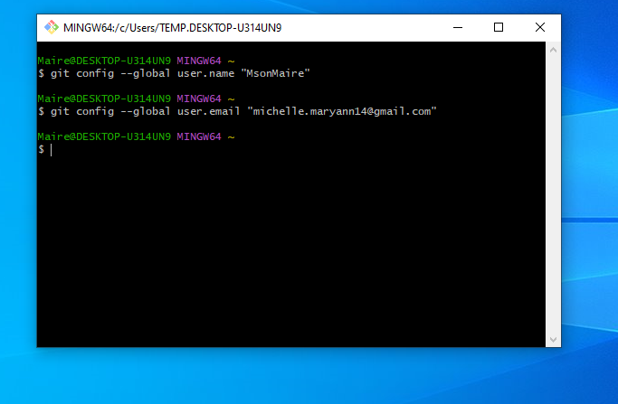
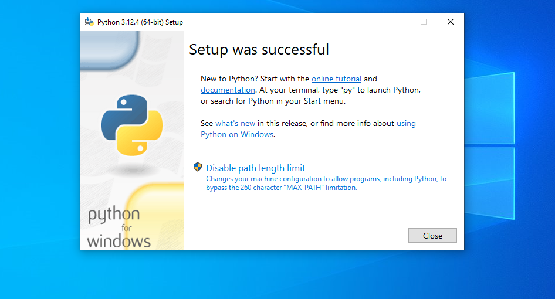
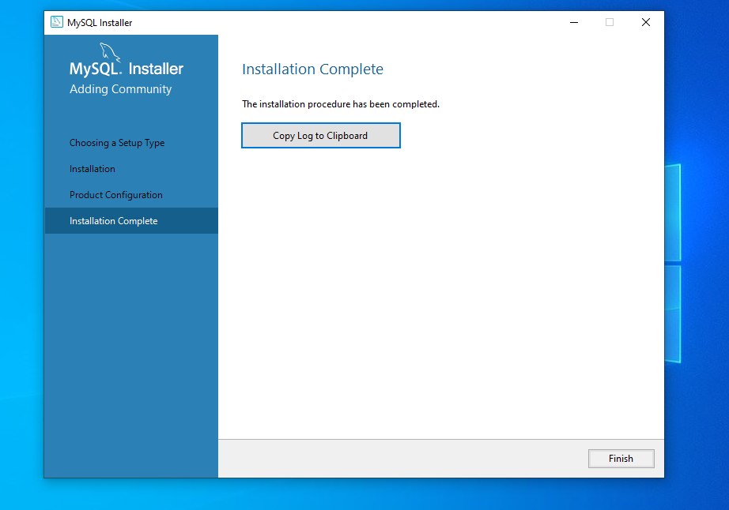

# Developer Environment Setup

This document outlines the steps I followed to set up my developer environment for efficient software development on Windows using CodeSpace, Git, Python, and MySQL.

## Environment Setup Steps

### Step 1: Select Your Operating System

I was already using Windows 11 as my operating system, so no installation was needed.

### Step 2: Install a Text Editor or IDE

I chose to use CodeSpace, which is similar to Visual Studio Code but hosted online.

### Step 3: Set Up Version Control System

- Installed Git using Git Bash on my local machine.
- Configured Git with my name and email.

### Step 4: Install Necessary Programming Languages and Runtimes

- Installed Python from [python.org](https://www.python.org/downloads/).
- Verified Python installation by running `python --version` and `pip --version`.

### Step 5: Install Package Managers

- Pip came installed automatically with Python.

### Step 6: Configure a Database (MySQL)

- Installed MySQL using the MySQL Installer for Windows.
- Chose the "Developer Default" setup type during installation.

### Step 7: Set Up Development Environments and Virtualization (Optional)

- Since I already had CodeSpace set up, I did not need to use Docker or virtual machines for isolation.

### Step 8: Explore Extensions and Plugins

- Explored available extensions and plugins within CodeSpace for syntax highlighting, linting, and Git integration.

### Step 9: Document Your Setup

I created this README.md file to document my setup process. Below are screenshots of my setup:

#### Screenshots

- **Git Bash Configuration:**

- **Python Installation Verification:**

  

- **MySQL Installation Confirmation:**

  

## Next Steps

- Customized CodeSpace further with additional extensions as needed.
- Began coding and using Git for version control with my projects.
- Explored more advanced features of MySQL for database development.

## Reflection

Setting up the development environment was straightforward due to the clear instructions provided. The challenges I encountered were primarily related to configuring MySQL properly and ensuring all dependencies were installed correctly. However, troubleshooting steps found online and in documentation helped resolve these issues efficiently.

---

This README.md file serves as a record of my setup process and will be useful for reference in the future or for sharing with teammates to replicate a similar development environment.

